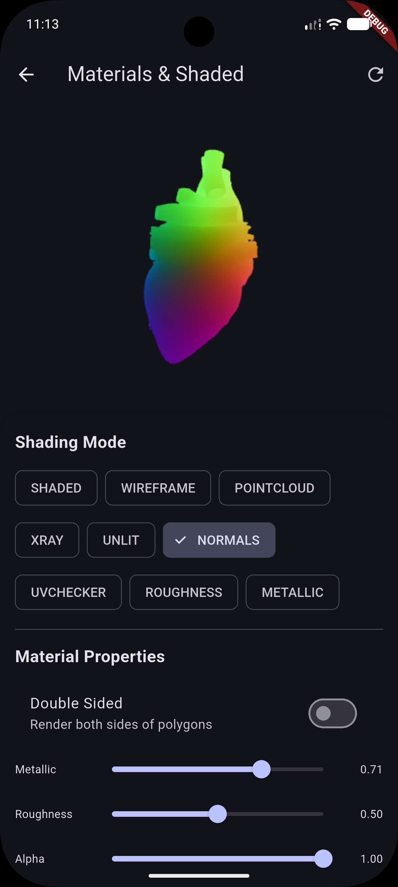
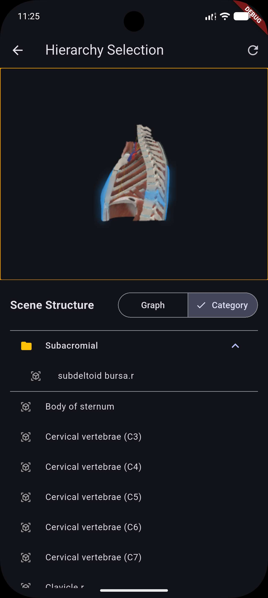
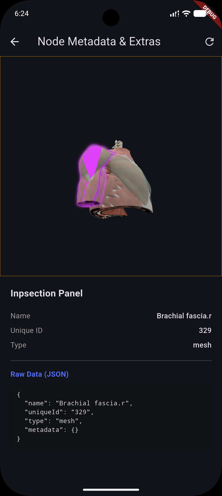
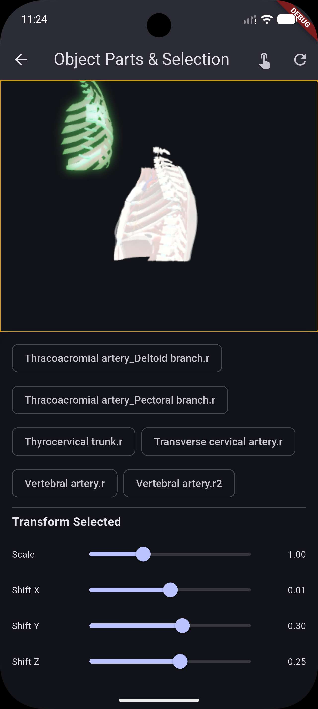
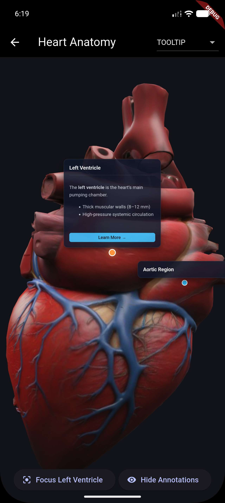
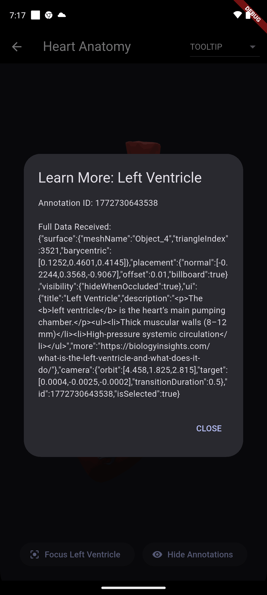
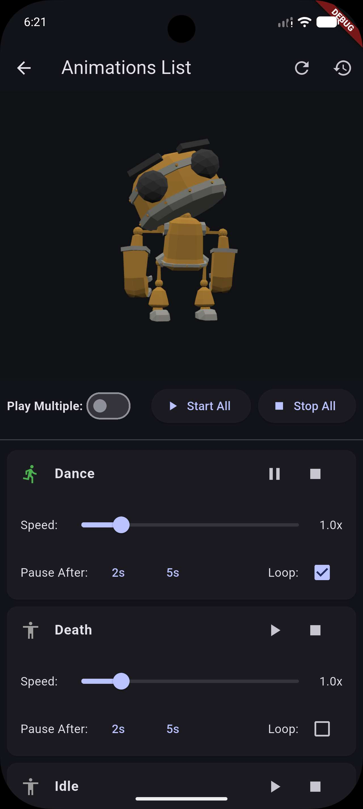
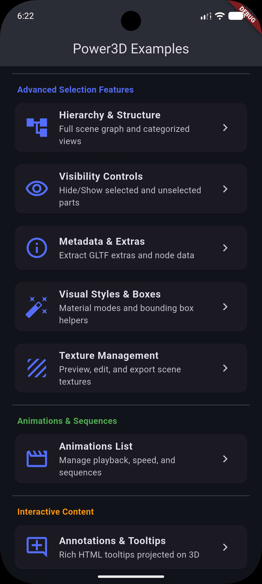

# Power3D

[](https://pub.dev/packages/power3d)
[](https://dart.dev)
[](https://opensource.org/licenses/MIT)

A powerful, industry-level Flutter plugin for rendering 3D models using Babylon.js. Designed for ease of use, extensibility, and seamless integration into any architecture.

[**pub.dev**](https://pub.dev/packages/power3d) | [**Repository**](https://github.com/rashbip/power_3d) | [**Documentation**](./doc) | [**Examples**](./example)

## 📸 Showcase

| **Core Viewer** | **Advanced Lighting** | **Material Shading** |
| :---: | :---: | :---: |
|  |  |  |
| _Main View_ | _Lighting Engine_ | _PBR Overrides_ |

| **Scene Graph** | **Part Inspector** | **Metadata Systems** |
| :---: | :---: | :---: |
|  |  |  |
| _Hierarchy Tree_ | _Mesh Explorer_ | _GLTF Extras_ |

| **Texture Management** | **Selection System** | **Visibility Controls** |
| :---: | :---: | :---: |
|  |  |  |
| _Bitmap extraction_ | _Mesh highlighting_ | _Per-part Toggles_ |

| **Interactive Points** | **Annotation Data** | **Bounding Boxes** |
| :---: | :---: | :---: |
|  |  |  |
| _Hotspot Logic_ | _Detail Cards_ | _Selection Feedback_ |

| **Skeletal System** | **Alternative Scene** | |
| :---: | :---: | :---: |
|  |  | |
| _Dynamic Animation_ | _Secondary View_ | |

## Features

- **🚀 Architecture Agnostic**: Uses a Controller pattern, compatible with Riverpod, Bloc, Provider, GetX, or plain `setState`.
- **📦 Versatile Loading**: Load models from Assets, Network, or local Files.
- **🎮 Advanced Controls**: 
    - Auto-rotation with custom speed and direction.
    - Automatic stop timer for rotation.
    - Zoom limits (min/max) and toggles.
    - Position locking (enable/disable panning).
- **🎬 Animation Control**: 
    - Play, pause, stop, and resume skeletal animations.
    - Real-time speed and loop configuration.
    - Support for multiple simultaneous animations.
- **Managed Screenshots**: Capture and automatically save screenshots to a specified path.
- **🎨 Scene Inspection**:
    - **Inspector Hierarchy**: Full scene graph (Meshes, Cameras, Lights) and Materials view.
    - **Metadata Extraction**: Fetch raw GLTF extras and Babylon metadata.
    - **3D Bounding Boxes**: Customizable wireframe boxes and spheres for selection feedback.
    - **Visibility Handling**: Per-part visibility controls and batch actions.
- **🎨 Customizable UI**: Provide your own loading and error widgets.

## Quick Start

### 1. Add dependency
```yaml
dependencies:
  power3d: ^2.2.0
```

### 2. Basic Setup
Power3D supports **Android, iOS, Web, Windows, macOS, and Linux**. 

| Platform | Setup Requirement |
| :--- | :--- |
| **Android** | Internet & Cleartext permissions |
| **iOS / macOS** | App Sandbox Entitlements |
| **Windows** | WebView2 Runtime |
| **Web** | No special config (CORS handled) |
| **Linux** | WebKit2GTK installation |

See the full **[Platform Setup Guide](doc/setup.md)** for detailed instructions.

### 3. Usage

```dart
import 'package:power3d/power3d.dart';

// 1. Create a controller
final controller = Power3DController();

// 2. Add the widget
Power3D.fromAsset(
  'assets/my_model.glb',
  controller: controller,
);

// 3. Control the view
void rotate() {
  controller.updateRotation(
    enabled: true,
    speed: 1.5,
    stopAfter: Duration(seconds: 5),
  );
}
```

## Documentation

Find detailed guides and API references in the [doc](./doc) folder:

### 🚀 Getting Started
- **[Installation & Setup](./doc/setup.md)**: Android/iOS permissions and basic configuration.
- **[First Model](./doc/get_started.md)**: A step-by-step guide to rendering your first 3D scene.
- **[Loading Models](./doc/load_model.md)**: Details on loading from Assets, Network, and Local Files.

### 🎮 Controls & Interaction
- **[Camera & Rotation](./doc/controls.md)**: Auto-rotation, zoom limits, and position locking.
- **[Animations](./doc/animations.md)**: Playing, pausing, and controlling skeletal animations.
- **[Light & Atmosphere](./doc/lighting.md)**: Configuring hemispheric, directional, and point lights.
- **[Environment & Background](./doc/environment.md)**: Customizing the scene environment.

### 🎨 Advanced Scene Manipulation
- **[Object Selection](./doc/selection_and_parts.md)**: Basic part identification and selection.
- **[Advanced Selection](./doc/advanced_selection.md)**: Hierarchy, visibility, and bounding boxes.
- **[Materials & Shading](./doc/materials.md)**: Overriding materials and applying shading modes.
- **[Object Parts](./doc/object_parts.md)**: Detailed guide on working with GLTF nodes.

### 🛠 Technical Reference
- **[API Reference](./doc/api_reference.md)**: Full controller and model documentation.
- **[Optimization Guide](./doc/babylonjs_optimization.md)**: Tips for high-performance rendering.
- **[Babylon.js Version Info](./doc/babylonjs_version_info.md)**: Understanding the underlying 3D engine.

## Example

Check the `example` folder for a complete demonstration of all features.
