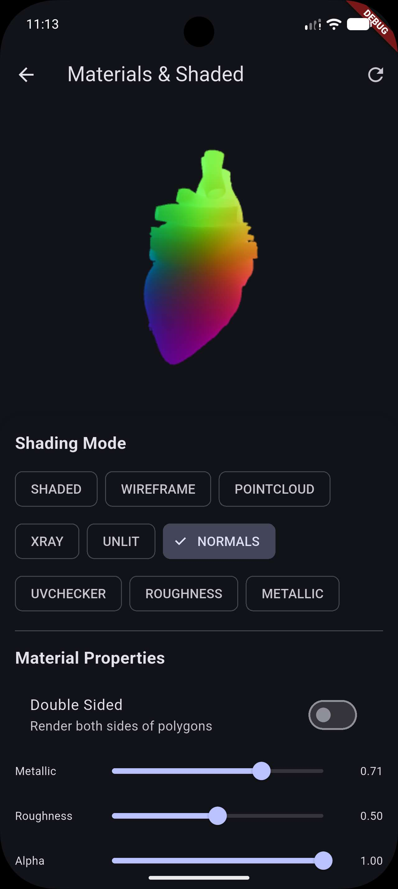

# Materials & Shading Modes

Power3D provides comprehensive control over how 3D models are rendered, including debug views, unlit modes, and global material property overrides.



## Shading Modes

Shading modes allow you to switch the entire scene's rendering style.

| Mode | Description |
|------|-------------|
| `shaded` | Default PBR/Standard shading with textures and lighting. |
| `wireframe` | Renders the geometry as a skeletal wireframe. |
| `pointCloud` | Renders only the vertices of the model. |
| `xray` | Makes the model semi-transparent (ghost-like). |
| `unlit` | Disables lighting calculation; only base colors/textures are shown. |
| `normals` | Visualizes surface normals as colors (RGB -> XYZ). |
| `uvChecker` | Replaces textures with a checkerboard pattern to debug texture mapping. |
| `roughness` | Visualizes the roughness map/value (grayscale). |
| `metallic` | Visualizes the metallic map/value (grayscale). |

### Usage
```dart
controller.setShadingMode(ShadingMode.wireframe);
```

---

## Global Material Configuration

You can override specific material properties across all meshes in a model using `MaterialConfig`.

### Properties

| Property | Type | Description |
|----------|------|-------------|
| `color` | `Color?` | Base albedo/diffuse color override. |
| `metallic` | `double?` | Metallic factor (0.0 to 1.0). |
| `roughness` | `double?` | Roughness factor (0.0 to 1.0). |
| `alpha` | `double?` | Overall transparency (0.0 to 1.0). |
| `emissiveColor` | `Color?` | Color emitted by the material (glow). |
| `doubleSided` | `bool?` | Whether to render back-faces (disables back-face culling). |

### Usage
```dart
controller.setGlobalMaterial(MaterialConfig(
  color: Colors.red,
  metallic: 0.9,
  roughness: 0.1,
  doubleSided: true,
));
```

> **Note:** Material properties and shading modes are persistent. If you load a new model, the `Power3DController` will automatically re-apply the current settings to the new meshes.
