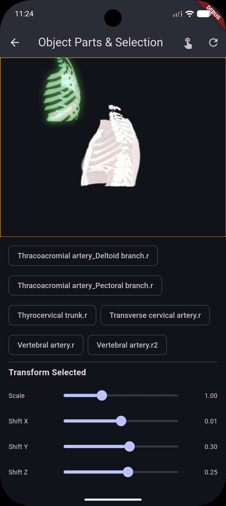

# Object Parts Detection & Selection

Power3D allows you to detect individual parts (meshes) in a 3D model and implement interactive selection with visual feedback and transformations.



---

## Features

- **Parts Detection**: Automatically detect and list all meshes in a loaded model
- **Click-to-Select**: Enable interactive selection by clicking on model parts
- **Single/Multiple Selection**: Support both single and multiple selection modes
- **Visual Feedback**: Apply custom styles to selected and unselected parts
- **Transformations**: Scale and offset selected parts
- **Event Callbacks**: React to selection changes in your Flutter code

---

## Selection Configuration

### SelectionConfig

Configure the selection behavior with the `SelectionConfig` class:

| Property | Type | Default | Description |
|----------|------|---------|-------------|
| `enabled` | `bool` | `false` | Enable/disable click-to-select functionality |
| `multipleSelection` | `bool` | `false` | Allow multiple parts to be selected simultaneously |
| `selectionStyle` | `SelectionStyle?` | `null` | Visual style for selected parts |
| `unselectedStyle` | `SelectionStyle?` | `null` | Visual style for unselected parts |
| `scaleSelection` | `double` | `1.0` | Scale factor for selected parts (e.g., 1.2 = 20% larger) |
| `selectionShift` | `SelectionShift?` | `null` | Offset/shift for selected parts |

### SelectionStyle

Define visual appearance for parts:

| Property | Type | Description |
|----------|------|-------------|
| `highlightColor` | `Color?` | Emissive color applied to the part (glow effect) |
| `outlineColor` | `Color?` | Color of the outline/border |
| `outlineWidth` | `double?` | Thickness of the outline |

### SelectionShift

Offset selected parts in 3D space:

| Property | Type | Default | Description |
|----------|------|---------|-------------|
| `x` | `double` | `0` | Offset along X-axis |
| `y` | `double` | `0` | Offset along Y-axis (typically "up") |
| `z` | `double` | `0` | Offset along Z-axis |

---

## Usage Examples

### Basic Setup

```dart
final controller = Power3DController();

// Enable selection
await controller.updateSelectionConfig(SelectionConfig(
  enabled: true,
  selectionStyle: SelectionStyle(
    highlightColor: Colors.greenAccent.withOpacity(0.6),
    outlineColor: Colors.green,
    outlineWidth: 2.0,
  ),
));
```

### Get Available Parts

```dart
// Retrieve list of all meshes in the model
final parts = await controller.getPartsList();
print('Available parts: $parts');

// Or access from state
controller.addListener(() {
  print('Parts: ${controller.value.availableParts}');
});
```

### Select Parts Programmatically

```dart
// Select a specific part
await controller.selectPart('headMesh');

// Unselect a part
await controller.unselectPart('headMesh');

// Clear all selections
await controller.clearSelection();
```

### React to Selection Events

```dart
controller.onPartSelected((partName, selected) {
  print('$partName was ${selected ? "selected" : "deselected"}');
});
```

### Multiple Selection

```dart
await controller.updateSelectionConfig(SelectionConfig(
  enabled: true,
  multipleSelection: true,
));
```

### Transform Selected Parts

```dart
await controller.updateSelectionConfig(SelectionConfig(
  enabled: true,
  scaleSelection: 1.3, // Make selected parts 30% larger
  selectionShift: SelectionShift(y: 0.5), // Lift selected parts up
  selectionStyle: SelectionStyle(
    highlightColor: Colors.yellow.withOpacity(0.5),
  ),
));
```

### Style Unselected Parts

```dart
await controller.updateSelectionConfig(SelectionConfig(
  enabled: true,
  unselectedStyle: SelectionStyle(
    highlightColor: Colors.grey.withOpacity(0.2), // Dim unselected parts
  ),
  selectionStyle: SelectionStyle(
    highlightColor: Colors.blue.withOpacity(0.7), // Bright selected parts
  ),
));
```

---

## Complete Example

```dart
class MySelectionDemo extends StatefulWidget {
  @override
  State<MySelectionDemo> createState() => _MySelectionDemoState();
}

class _MySelectionDemoState extends State<MySelectionDemo> {
  late Power3DController controller;

  @override
  void initState() {
    super.initState();
    controller = Power3DController();
    
    // Configure selection
    controller.updateSelectionConfig(SelectionConfig(
      enabled: true,
      multipleSelection: true,
      scaleSelection: 1.2,
      selectionShift: SelectionShift(y: 0.3),
      selectionStyle: SelectionStyle(
        highlightColor: Colors.greenAccent.withOpacity(0.6),
        outlineColor: Colors.green,
        outlineWidth: 2.0,
      ),
      unselectedStyle: SelectionStyle(
        highlightColor: Colors.grey.withOpacity(0.3),
      ),
    ));

    // Listen to selection events
    controller.onPartSelected((partName, selected) {
      ScaffoldMessenger.of(context).showSnackBar(
        SnackBar(content: Text('$partName: $selected')),
      );
    });
  }

  @override
  Widget build(BuildContext context) {
    return Scaffold(
      body: Column(
        children: [
          Expanded(
            child: Power3D.fromAsset(
              'assets/car.glb',
              controller: controller,
            ),
          ),
          ValueListenableBuilder(
            valueListenable: controller,
            builder: (context, state, _) {
              return Wrap(
                children: state.availableParts.map((part) {
                  return FilterChip(
                    label: Text(part),
                    selected: state.selectedParts.contains(part),
                    onSelected: (_) {
                      if (state.selectedParts.contains(part)) {
                        controller.unselectPart(part);
                      } else {
                        controller.selectPart(part);
                      }
                    },
                  );
                }).toList(),
              );
            },
          ),
        ],
      ),
    );
  }
}
```

---

## Implementation Notes

- **Parts Detection**: Parts are detected when a model finishes loading. The `availableParts` list is automatically populated.
- **Raycasting**: Click detection uses Babylon.js raycasting to identify the picked mesh.
- **Performance**: Visual effects (outlines, highlights) use Babylon.js `HighlightLayer` for efficient rendering.
- **State Management**: Selection state is managed both in JavaScript and synchronized with the Flutter `Power3DState`.
- **Persistence**: Selection configuration persists across model loads and is automatically re-applied.
