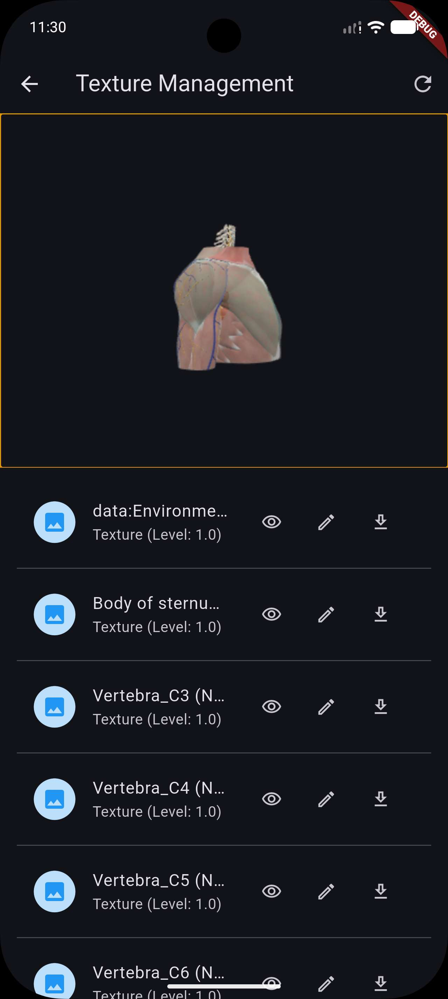

# Texture Management

Power3D allows you to interact directly with the texture engine of Babylon.js. You can list all textures in a scene, preview their raw data, and edit properties like brightness and tiling in real-time.



## Fetching Textures

Use `getTexturesList()` to get a list of all active textures in the current scene. This includes image-based textures, procedural textures, and render targets.

```dart
final textures = await controller.getTexturesList();

for (var texture in textures) {
  print('Texture: ${texture.name} (${texture.className})');
  print('Level: ${texture.level}');
}
```

### Power3DTexture Properties

| Property | Type | Description |
|----------|------|-------------|
| `uniqueId` | `String` | Engine unique identifier. |
| `name` | `String` | Human-readable name (often the filename). |
| `className` | `String` | Babylon.js class (e.g., `Texture`, `ProceduralTexture`). |
| `isRenderTarget`| `bool` | True if the texture is a dynamic render target. |
| `level` | `double` | Brightness/intensity multiplier. |
| `uScale`/`vScale`| `double` | Tiling/Scaling factors. |
| `uOffset`/`vOffset`| `double` | Panning/Translation offsets. |
| `url` | `String?` | The source URL if it's a file-based texture. |

---

## Extracting Texture Data

To show a preview or export a texture to a file, you need the raw pixel data. Power3D uses an asynchronous message-based bridge to fetch this.

### Previewing in Flutter
```dart
// Returns a Base64-encoded PNG data URL
final base64Data = await controller.getTextureData(texture.uniqueId);

if (base64Data != null) {
  final bytes = base64Decode(base64Data.split(',').last);
  showDialog(
    context: context,
    builder: (context) => Image.memory(bytes),
  );
}
```

### Exporting to File
```dart
final path = "path/to/save/texture.png";
final savedPath = await controller.exportTexture(texture.uniqueId, path);

if (savedPath != null) {
  print("Texture saved to $savedPath");
}
```

---

## Real-time Editing

You can modify texture properties on the fly using `updateTexture()`. This is useful for interactive material editors.

```dart
controller.updateTexture(
  texture.uniqueId,
  TextureUpdate(
    level: 2.0,      // Increase brightness
    uScale: 5.0,     // Increase horizontal tiling
    vScale: 5.0,     // Increase vertical tiling
  ),
);
```

### TextureUpdate Options

| Option | Type | Description |
|--------|------|-------------|
| `level` | `double?`| Overrides the texture level (intensity). |
| `uScale` | `double?`| Overrides horizontal scaling. |
| `vScale` | `double?`| Overrides vertical scaling. |
| `uOffset`| `double?`| Overrides horizontal offset. |
| `vOffset`| `double?`| Overrides vertical offset. |

---

## Lifecycle & Reliability

- **`onModelLoaded`**: It is recommended to scan for textures after the model has fully loaded. Use the `onModelLoaded` callback in the `Power3D` widget.
- **Async Safety**: `getTextureData` has a built-in 10-second timeout. Large textures or complex procedural shaders may take longer to read from GPU memory.
- **Disposal**: The controller automatically cleans up its internal texture message listeners when `dispose()` is called.
